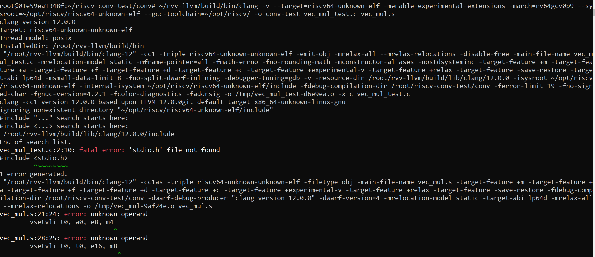
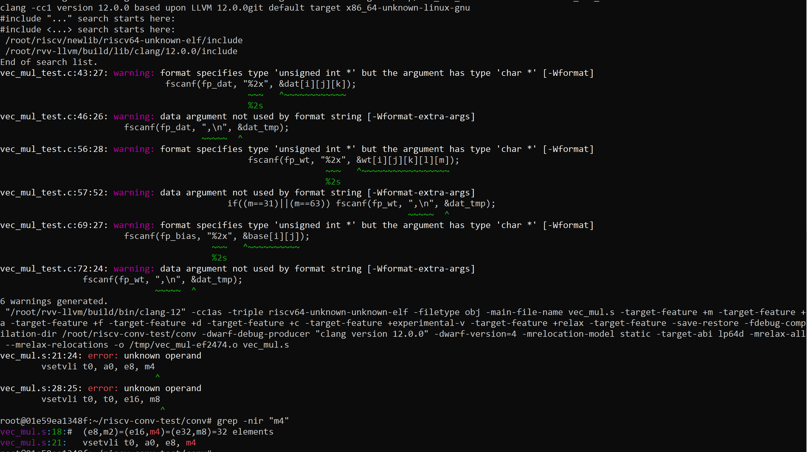

## Task1 卷积测试结果GCC和Clang输出结果不一致

### 问题描述

卷积测试结果不正确

（https://github.com/isrc-cas/rvv-llvm/issues/6）

任务：

1. 复现issue;

2. 可以对比 https://github.com/jiazhaorong/riscv-conv-test/blob/main/conv/vec_mul.s 这个代码在gcc和llvm中生成的二进制是否一样。（复现结果是GCC和Clang一致，于是这一步没有做）

*（由于完全从裸机开始做，遇到很多问题，部分是工具上的，遇到的问题记录在分支任务里。）*

### 复现步骤

#### 工具安装

1. riscv gnu toolchain

 (https://github.com/riscv/riscv-gnu-toolchain)

2. rvv llvm

(https://github.com/isrc-cas/rvv-llvm)

3. spike

(https://github.com/riscv/riscv-isa-sim)

4. pk

(https://github.com/riscv/riscv-pk)

安装pk时报gcc的参数无法识别，将riscv gnu toolchain的bin目录添加到PATH中，就可以了。

#### 编译

- Clang

编译命令：

```shell
~/rvv-llvm/build/bin/clang --target=riscv64-unknown-elf -menable-experimental-extensions -march=rv64gcv0p9 --sysroot=~/opt/riscv/riscv64-unknown-elf --gcc-toolchain=~/opt/riscv -o conv-test vec_mul_test.c vec_mul.s
```

编译中遇到的问题：

问题1

```shell
/root/rvv-llvm/build/bin/clang: error while loading shared libraries: libtinfo.so.5: cannot open shared object file: No such file or directory
```

解决方法： apt-get install libtinfo5

问题2



报错：stdio.h找不到，可能是只gnu tool只构建了newlib版本。需要重新构建gnu tool，并且newlib和linux两个版本都要构建。

gnu toolchain构建方法参见：

https://github.com/sunshaoce/learning-riscv/blob/main/%E5%AE%89%E8%A3%85RISC-V%E7%BC%96%E8%AF%91%E7%8E%AF%E5%A2%83.md

问题3

在解决问题2后，即重新构建了gnu tool的两个版本，执行下面的编译命令：

```shell
~/rvv-llvm/build/bin/clang --target=riscv64-unknown-elf -menable-experimental-extensions -march=rv64gcv0p9 --sysroot=$HOME/riscv/newlib/riscv64-unknown-elf --gcc-toolchain=$HOME/riscv/newlib -o conv-test vec_mul_test.c vec_mul.s
```

仍然报错：


报错信息：unknown operand

解决方法：需要在测试程序的汇编指令后面加上`tu,mu`。`llvm/lib/Target/RISCV/AsmParser`目前的实现是强制要有`tu,mu`这些参数，不能省略。rvv spec中也提到了，最好是强制。

参见 `llvm/test/MC/RISCV/rvv/vsetvl.s`中的写法。

最后我修改了下面两行，加上了`tu,mu`，这个问题就解决了。
```shell
vec_mul.s:21:   vsetvli t0, a0, e8, m4,tu,mu
vec_mul.s:28:   vsetvli t0, t0, e16, m8,tu,mu
```

- GCC


编译命令：
```shell
 $HOME/rvv/newlib/bin/riscv64-unknown-elf-gcc -march=rv64gcv -o conv-test-gcc vec_mul_test.c vec_mul.s
```

编译过程遇到的问题是构建gnu tool 时没有切换到rvv分支就开始构建了，这样编译测试文件会报`unrecognized opcode`。


后来从master上切换到rvv-0.9.x分支，构建完编译测试程序还是会报相同的错，可能是这样切换不成功。最后是直接从gh源上clone rvv-0.9.x分支（速度很慢，大概20KiB/s）(`git clone --recursive --depth=1 git@github.com:riscv/riscv-gnu-toolchain.git -b rvv-0.9.x`) 这样构建出来的gnu tool再去编译测试程序，就没有问题了。

#### 仿真运行

```shell
spike --isa=RV64gcv pk conv-test 
```

输出结果会写到`RISCV-OUTPUT.TXT`中,但是需要提前新建这个文件，不然结果会报segfualt，如下所示：


#### 程序结果

实际运行得到的结果，即`RISCV-OUTPUT.TXT`，GCC和Clang编译出来没有差异，没有复现出issue中提到的问题。


### 分支任务

#### 安装wsl

参考：

https://docs.microsoft.com/zh-cn/windows/wsl/install-win10 

安装wsl中的问题：

无法将词语“wsl”识别为cmdlet、函数、脚本文件或可运行程序的名称。

解决方法：执行完powershell命令重启的时候，要选择“更新并重启”。

#### 解决终端远程连接卡死的问题

本地终端ssh连接远程服务器，不断时间不操作就会卡住。解决的方法是在本地ssh配置keepalive。并且为了不使远程任务因终端断线而停止，使用ssh+tmux。

- ssh配置keepalive
```shell
cat >> $HOME/.ssh/config << "EOT"
Host *
TCPKeepAlive yes
ServerAliveInterval 15
ServerAliveCountMax 6
StrictHostKeyChecking no
ForwardAgent yes
Compression yes
IPQoS throughput
EOT
```

- ssh+tmux

新建
```shell
tmux new -s SESSIONNAME
```

断开
```shell
tmux detach #断开当前会话，会话在后台运行，或者C-b然后d
```
查看所有会话
```shell
tmux ls #查看所有会话
```

进入之前的会话
```shell
tmux a -t SESSIONNAME #进入名为SESSIONNAME的会话
```

关闭会话
```shell
tmux kill-session -t SESSIONNAME
```

参考 https://www.cnblogs.com/clemente/p/12355520.html

tmux屏上下滚动: `C-b`然后`[`，推出是`q`。
